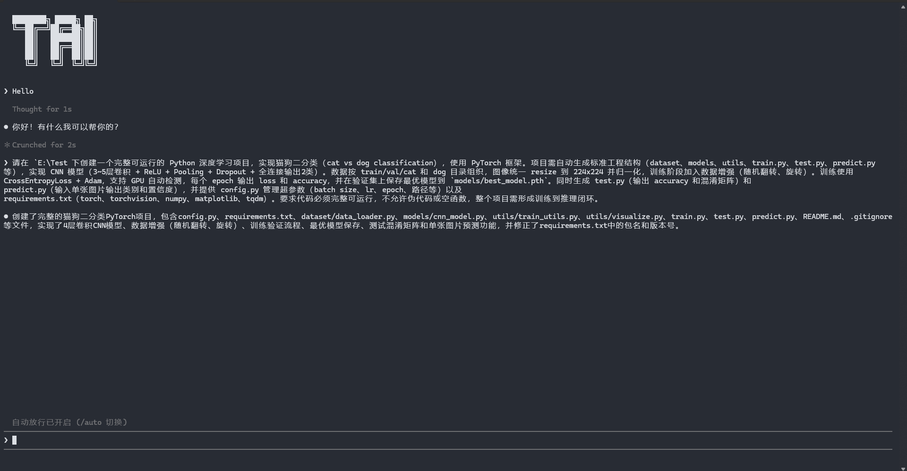
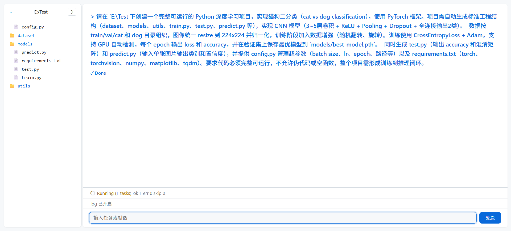

# TAICode

> An AI Coding Agent built with LangGraph.

TAICode 是一个学习Agent，模仿 Claude Code 的 AI Coding Agent，基于 LangGraph、ReAct 与 DAG Workflow 构建，支持 Memory、MCP、Skills、多 Agent 协同及 TUI / Web 双界面。

---

## Features

- 基于 LangGraph 状态机构建 Agent Runtime
- 双层 LLM 路由（Gate + Planner）
- ReAct Planner 与 TaskSplitter
- 四层 Memory（短期、语义、用户画像、规则）
- Context Compiler（EMA 评分、上下文去噪、动态压缩）
- Event-driven DAG Scheduler（支持最多 8 个 Worker 并发执行）
- Skill RAG（本地 Embedding 自动检索）
- Model Context Protocol（stdio / SSE）
- 四层 Guard 安全机制
- React/Ink Terminal UI
- Fastify + WebSocket Web UI

---

## Demo

### Terminal



### Web



---

## Architecture

```text
                              User
                                │
               ┌────────────────┴────────────────┐
               │                                 │
             Chat                              Task
               │                                 │
               ▼                                 ▼
        Stream Output                      Gate (LLM)
                                                 │
                                  ┌──────────────┴──────────────┐
                                  │                             │
                             Simple Task                  Complex Task
                                  │                             │
                               Worker                    Planner (ReAct)
                                                                │
                                                         TaskSplitter
                                                                │
                                                                ▼
                                                         DAG Scheduler
                                                                │
                                                        Multiple Workers
                                                                │
                                                            Validator
                                                                │
                                                          Final Summary


Runtime

EventBus
├── Memory
├── MCP
├── Skills
├── Sandbox
└── Telemetry(spanId)
```

---

## Core Components

### Agent Runtime

TAICode 基于 LangGraph 构建 Agent Runtime。

整个系统采用状态机驱动，将聊天、任务规划、任务执行、结果汇总等流程统一建模，使 Agent 生命周期具有良好的可维护性与可扩展性。

---

### Memory

采用四层记忆系统：

- 短期记忆
- 语义记忆
- 用户画像
- 规则记忆

使用 Xenova `all-MiniLM-L6-v2`（384 维）完成本地向量化，实现长期知识存储、上下文持久化与经验复用。

---

### Context Compiler

长任务执行过程中会不断积累上下文。

Context Compiler 负责：

- EMA 评分
- Context 去噪
- 动态压缩
- 历史结果筛选

自动过滤低价值信息，提高长上下文场景下的信息质量。

---

### Planner

复杂任务采用 ReAct 工作流。

Planner 不直接规划，首先通过：

- ls
- read_file
- grep

等工具感知项目状态，再完成任务拆解与执行规划，降低 LLM 幻觉带来的影响。

---

### Scheduler

所有任务都会建模为 DAG。

Scheduler 根据依赖关系自动调度 Worker，仅在依赖满足时触发后续节点，实现任务级并行执行。

特点：

- Dependency Graph
- Parallel Scheduling
- Multi Worker
- Dependency-aware Execution

目前支持最多 8 个 Worker 并发执行。

---

### Worker

Worker 专注执行，不参与规划。

为了保证长任务稳定性，实现四层死循环检测：

- 重复回复检测
- 重复工具调用检测
- Snapshot Diff 检测
- 同类错误检测

同时结合超时机制避免 Worker 假死。

---

## Tool System

内置文件系统与 Shell 工具：

- read_file
- write_file
- mkdir
- cp
- mv
- rm
- stat
- ls
- grep
- find
- sed
- shell

Shell 工具采用：

- spawn()
- killTree()

每条命令独立进程执行。

权限分为三级：

| Level  | Description |
| ------ | ----------- |
| safe   | 直接执行    |
| warn   | 用户确认    |
| danger | 拒绝执行    |

---

## MCP

支持 Model Context Protocol。

支持两种传输方式：

| Transport | Status    |
| --------- | --------- |
| stdio     | Supported |
| SSE       | Supported |

MCP 工具自动发现、自动注册，并统一采用 JSON-RPC 2.0 通信。

所有 MCP Tool 默认继承 Guard 与 Sandbox 权限体系。

---

## Skills

Skill 基于 RAG 实现。

启动时自动扫描：

```text
.TAI/skills/
```

执行流程：

```text
Markdown

↓

SHA-256 增量同步

↓

Embedding

↓

Cosine Search

↓

Planner Prompt
```

匹配到的 Skill 会自动注入 Planner Prompt，无需人工维护长 Prompt。

---

## Tech Stack

### Runtime

- TypeScript
- Node.js

### AI

- LangGraph
- LangChain
- OpenAI SDK

### UI

- React
- Ink
- Fastify
- WebSocket

### Embedding

- Xenova Transformers
- all-MiniLM-L6-v2

---

## Quick Start

安装：

```bash
npm install -g taicode
```

Terminal：

```bash
taicode
```

Web：

```bash
taicode --web
```

默认地址：

```text
http://localhost:3000
```

---

## Commands

| Command | Description      |
| ------- | ---------------- |
| /auto   | 自动放行危险命令 |
| /log    | 日志开关         |
| /exit   | 退出             |

---

## Roadmap

- [X] LangGraph Runtime
- [X] ReAct Planner
- [X] Memory System
- [X] Context Compiler
- [X] DAG Scheduler
- [X] MCP
- [X] Skills
- [X] Web UI
- [ ] Multi-Agent Collaboration
- [ ] Plugin Marketplace
- [ ] Cloud Memory
- [ ] Tree Search

---

## License

Apache License 2.0

---

## Author

- **EndymionLee**
- **Claude**
